## Summary 

This post identifies how well Grade 3 and 6 students are performing in terms of their Education Quality and Accountability (EQAO) mathematics score. The two data visualizations below are broken down by Forward Sortation Area (FSA) for the entire province. Within each FSA is a percentage that identifies the proportion of Grade 3 or 6 students that are achieving the provincial standard, based on EQAO scores, in mathematics.

More information on EQAO scores can be located at the [EQAO website](http://www.eqao.com/en). 

## Analysis

### Data

Three sets of data were used in this analysis:
1)	[School information and student demographics]( https://www.ontario.ca/data/school-information-and-student-demographics) which contains Data on all publicly funded schools in Ontario, including school board, school address, provincial test results, student population demographics and class sizes;
2)	[Primary class size]( https://www.ontario.ca/data/primary-class-size) contains class sizes for each school in Ontario from grades 1 through 3 and a summation from grades 4 through 8; and
3)	[FSA boundary file for Canada](http://www5.statcan.gc.ca/olc-cel/olc.action?ObjId=92-179-X&ObjType=2&lang=en&limit=0) depicts the boundaries of forward sortation areas (FSAs) derived from postal codes captured from census questionnaires.

### R Libraries

The following R libraries were loaded into R for this analysis. 

```{r,message=FALSE,warning=FALSE,cache=TRUE}
library(dplyr);library(magrittr);library(ggplot2);library(readr)
library(readxl);library(extrafont);library(tmap);library(rgdal);
library(raster);library(tmaptools);library(tidyverse);library(broom)
library(viridis)
```

### Preprocessing

Several steps were required in order to clean and prep the data for analysis. School information and demographic data (SISD) had to be read into R, unsavory values (ie NA values) were removed and subsets of grade 3 and 6 information were constructed from the full set of data. The class size dataset (CSD), which contains information on primary class size information for every classroom and every school was summarized at the school-level in order to merge this dataset with the SISD dataset, which contains school and FSA information. 

A weighted achievement score was created using the merged SISD and CSD dataset which was then merged with the geospatial dataset. 

```{r,message=FALSE, cache=TRUE}
# Student grades and LI information 

# Reading geospatial information on student achievement and LI proportions
df<-read_xlsx("2018-05-12_Data/School information and student demographics/sif_data_table_2015_2016_en.xlsx",
              sheet=1)
# Code lists to remove NA values
code.list<-c("A/D","NA","N/R","N/A","S. R.","N/D")
code.list2<-c("NA","SP")

# Creating and then merging separate grade 3 and 6 data-frames, simplifying
# df's to only contain information needed for analysis
grade3math<-df %>%
  dplyr::select(`School Name`,`Percentage of Grade 3 Students Achieving the Provincial Standard in Mathematics`,
         `Percentage of Children Who Live in Low-Income Households`,
         Latitude,
         Longitude,
         Enrolment,
         `Postal Code`
  ) %>%
  filter(!(`Percentage of Grade 3 Students Achieving the Provincial Standard in Mathematics` %in% code.list),
         !(`Percentage of Children Who Live in Low-Income Households` %in% code.list2))%>%
  mutate(Grade="Grade 3",FSA=substr(`Postal Code`,1,3))
names(grade3math)[2]<-"Score"
names(grade3math)[3]<-"LI"
grade3math$Score<-as.numeric(grade3math$Score)
grade3math$LI<-as.numeric(grade3math$LI)

grade6math<-df %>%
  dplyr::select(`School Name`,`Percentage of Grade 6 Students Achieving the Provincial Standard in Mathematics`,
         `Percentage of Children Who Live in Low-Income Households`,
         Latitude,
         Longitude,
         Enrolment,
         `Postal Code`) %>%
  filter(!(`Percentage of Grade 6 Students Achieving the Provincial Standard in Mathematics` %in% code.list),
         !(`Percentage of Children Who Live in Low-Income Households` %in% code.list2))%>%
  mutate(Grade="Grade 6",FSA=substr(`Postal Code`,1,3))
names(grade6math)[2]<-"Score"
names(grade6math)[3]<-"LI"
grade6math$LI<-as.numeric(grade6math$LI)
grade6math$Score<-as.numeric(grade6math$Score)

# Class size information #

class.size<-read_xlsx("2018-05-12_Data/Primary Class Size/2016-10oct-20_-ontario_open_data_-_all_classes_1.xlsx",sheet=9)


class.size<-class.size %>%
  group_by(SCHOOLNAME) %>%
  summarise(G3ClassSize=sum(G3),G4TO8ClassSize=sum(G4TO8))
names(class.size)[1]<-"School Name"

# Merging class size, achievement and LI information
grade3math<-left_join(grade3math,class.size[,1:2])

# Note: Lose 436 GR3 schools due to school names being labelled differently
# between primary class size and student achievement datasets.
grade3math<-grade3math[complete.cases(grade3math),] 
grade6math<-left_join(grade6math,class.size[,c(1,3)])

# Note: Lose 439 GR6 schools due to school names being labelled differently
# between primary class size and student achievement datasets.
grade6math<-grade6math[complete.cases(grade6math),] 


# Creating new weighted achievement variable by FSA
grade3math2<- grade3math %>%
  mutate(NumStudents=Score*G3ClassSize) %>%
  group_by(FSA) %>%
  summarise(FSAScore=sum(NumStudents)/sum(G3ClassSize))
grade6math2<- grade6math %>%
  group_by(FSA) %>%
  summarise(FSAScore=mean(Score))

# Geospatial shapefile information #
shp <- shapefile("G:/Blog/2018-01-27_Toronto-Paramedic-Services-Incident-Post/Data/lfsa000b16a_e.shp") 
Ontario_shp<-shp[shp@data$PRNAME=="Ontario",] 
names(Ontario_shp@data)<-c("FSA","ID","PRNAME")

# Merging student achievement data with geo spatial data
Ontario_shp@data<-left_join(Ontario_shp@data,grade3math2)
names(Ontario_shp@data)[4]<-"Percent of Grade 3 Students"
Ontario_shp@data$`Percent of Grade 3 Students`<-Ontario_shp@data$`Percent of Grade 3 Students`*100

Ontario_shp@data<-left_join(Ontario_shp@data,grade6math2)
names(Ontario_shp@data)[5]<-"Percent of Grade 6 Students"
Ontario_shp@data$`Percent of Grade 6 Students`<-Ontario_shp@data$`Percent of Grade 6 Students`*100

# Creating rownames in order to merge with tidy() later on.
Ontario_shp@data$id<-rownames(Ontario_shp@data)
Ontario_shp2<-tidy(Ontario_shp, region="id")
Ontario_shp2<-left_join(Ontario_shp2,Ontario_shp@data,by="id")

Ontario_shp2<-Ontario_shp2 %>%
  mutate(Region=ifelse(grepl("P[0-9][A-Z]",FSA),"Northern Ontario",
                       ifelse(grepl("M[0-9][A-Z]",FSA),"Toronto",
                              ifelse(grepl("K[0-9][A-Z]",FSA),"Eastern Ontario",
                                     ifelse(grepl("N[0-9][A-Z]",FSA),"Southern Ontario",
                                            ifelse(grepl("L[0-9][A-Z]",FSA),"Central Ontario","NA"))))))


# Custom Map Theme
theme_map <- function(){
  theme_minimal() +
    theme(
      text = element_text(family = "Segoe UI", color = "gray25"),
      plot.title = element_text(size=16),
      plot.subtitle = element_text(size = 14),
      #legend.position = "top",
      axis.text = element_blank(),
      axis.title = element_blank(),
      plot.caption = element_text(color = "gray30", size=12),
      plot.background = element_rect(fill = "gray95"),
      panel.grid = element_blank()
      #axis.line = element_line(color="gray50")
      #axis.ticks.x = element_line(color="gray35"),
      #panel.grid.major.y = element_line(colour = "gray80")
      )
}
```

### Results

#### Proportion of Grade 3 Students Meeting the Provincial Standard in Mathematics by FSA

```{r,cache=FALSE,out.height="1000px",out.width="1000px",message=FALSE,warning=FALSE,dpi=300}

##################
# Grade 3 maps
##################

# # Ontario
# gr3_map0<-ggplot()+
#   geom_polygon(data=Ontario_shp2[complete.cases(Ontario_shp2),],
#                aes(x=long, y=lat,group=group,fill=`Percent of Grade 3 Students`),
#                color="black",size=0.0)
# gr3_map0<-gr3_map0+ scale_fill_viridis(option = "D",direction=-1)
# gr3_map0<-gr3_map0 + theme_map() + coord_fixed()
# gr3_map0<-gr3_map0 + labs(title="Percent of grade 3 students in Ontario meeting the\nprovincial standard in math",
#                 caption="Source: Ontario open data website | Creation: Anthony Ionno") 
# gr3_map0
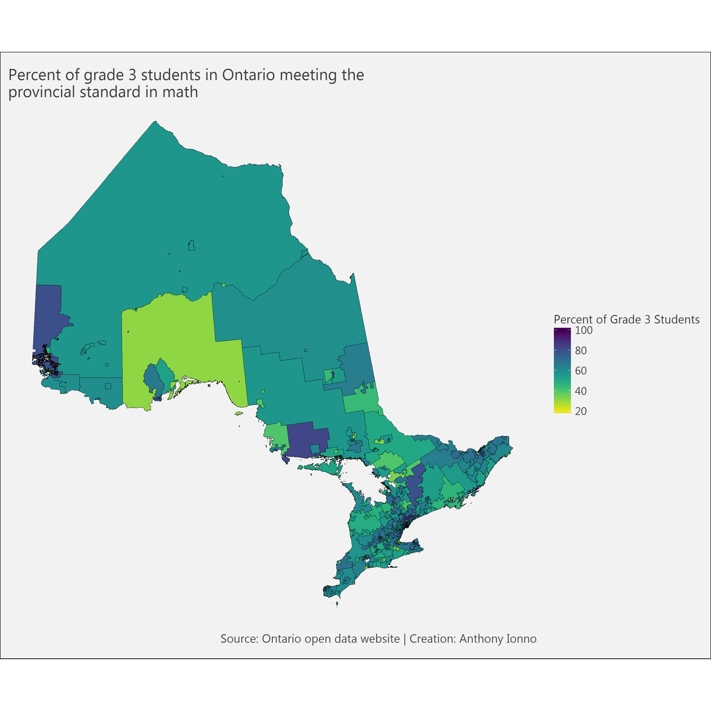           
# # Northern Ontario
# gr3_map1<-ggplot()+
#   geom_polygon(data=filter(Ontario_shp2,Region=="Northern Ontario"),
#                aes(x=long, y=lat,group=group,fill=`Percent of Grade 3 Students`),
#                color="black",size=0.0)
# gr3_map1<-gr3_map1+ scale_fill_viridis(option = "D",direction=-1)
# gr3_map1<-gr3_map1 + theme_map() + coord_fixed()
# gr3_map1 + labs(title="Percent of grade 3 students in northern Ontario meeting the\nprovincial standard in math",
#                 caption="Source: Ontario open data website | Creation: Anthony Ionno") 
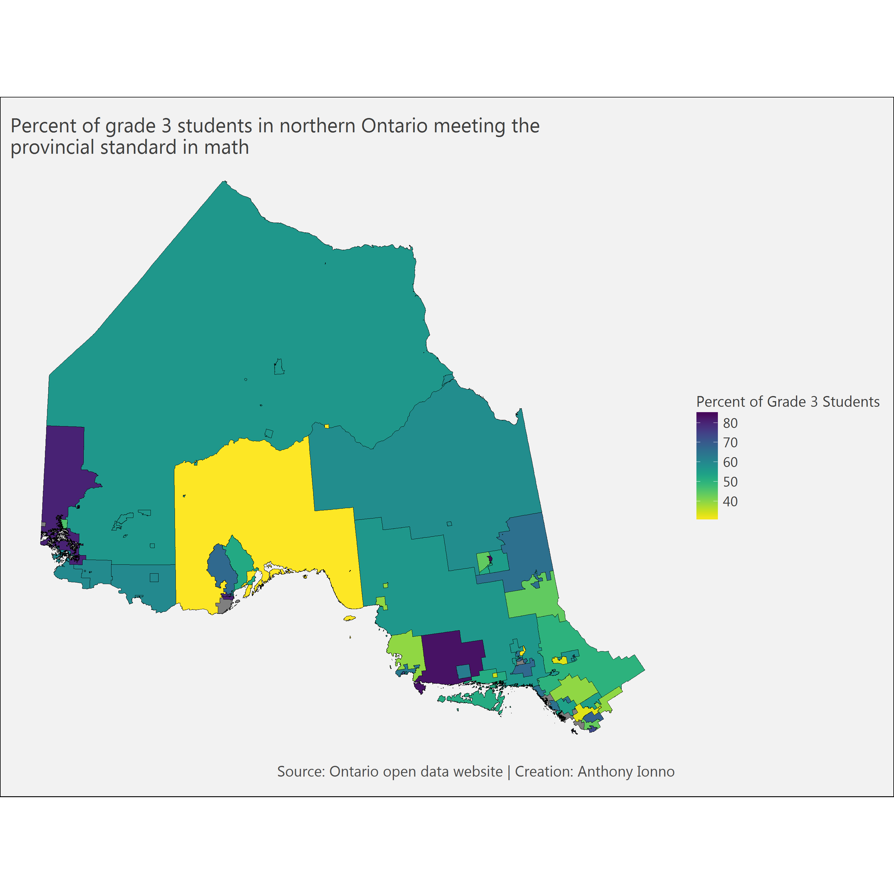 
# # Toronto
# gr3_map2<-ggplot()+
#   geom_polygon(data=filter(Ontario_shp2,Region=="Toronto"),
#                aes(x=long, y=lat,group=group,fill=`Percent of Grade 3 Students`),
#                color="black",size=0.0)
# gr3_map2<-gr3_map2+ scale_fill_viridis(option = "D",direction=-1)
# gr3_map2<-gr3_map2 + theme_map() + coord_fixed()
# gr3_map2 + labs(title="Percent of grade 3 students in Toronto meeting the\nprovincial standard in math",
#                 caption="Source: Ontario open data website | Creation: Anthony Ionno") 
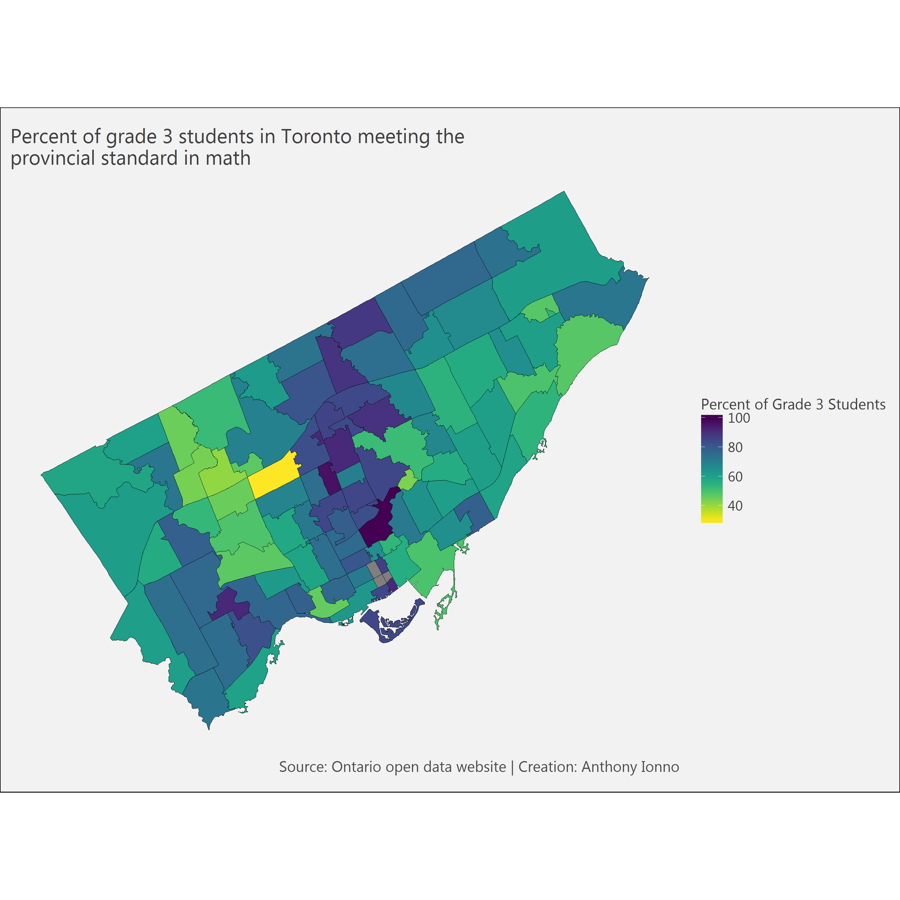 
# 
# # Central Ontario
# gr3_map3<-ggplot()+
#   geom_polygon(data=filter(Ontario_shp2,Region=="Central Ontario"),
#                aes(x=long, y=lat,group=group,fill=`Percent of Grade 3 Students`),
#                color="black",size=0.0)
# gr3_map3<-gr3_map3+ scale_fill_viridis(option = "D",direction=-1)
# gr3_map3<-gr3_map3 + theme_map() + coord_fixed()
# gr3_map3 + labs(title="Percent of grade 3 students in central Ontario meeting the\nprovincial standard in math",
#                 caption="Source: Ontario open data website | Creation: Anthony Ionno") 
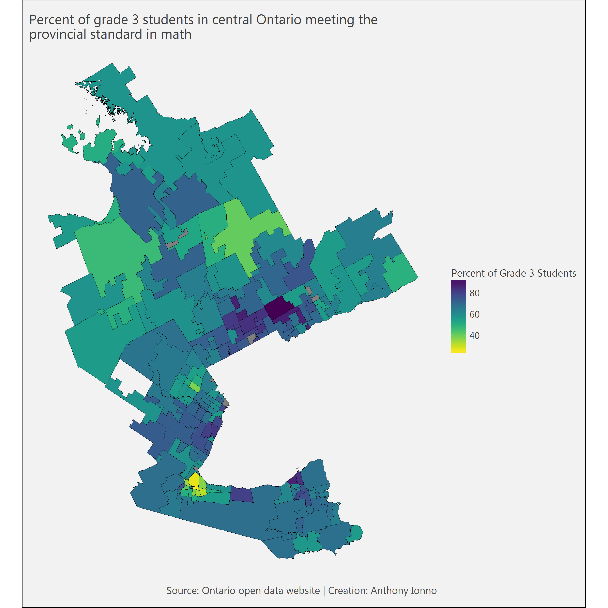 
# 
# # Eastern Ontario
# gr3_map4<-ggplot()+
#   geom_polygon(data=filter(Ontario_shp2,Region=="Eastern Ontario"),
#                aes(x=long, y=lat,group=group,fill=`Percent of Grade 3 Students`),
#                color="black",size=0.0)
# gr3_map4<-gr3_map4+ scale_fill_viridis(option = "D",direction=-1)
# gr3_map4<-gr3_map4 + theme_map() + coord_fixed()
# gr3_map4 + labs(title="Percent of grade 3 students in eastern Ontario meeting the\nprovincial standard in math",
#                 caption="Source: Ontario open data website | Creation: Anthony Ionno") 
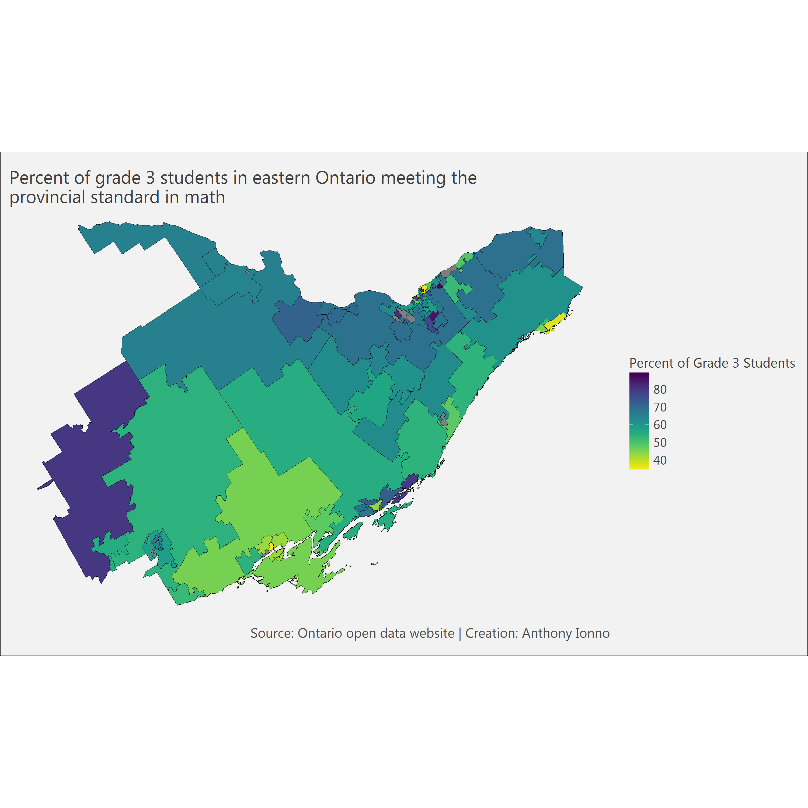 
# # Southern Ontario
# 
# gr3_map5<-ggplot()+
#   geom_polygon(data=filter(Ontario_shp2,Region=="Southern Ontario"),
#                aes(x=long, y=lat,group=group,fill=`Percent of Grade 3 Students`),
#                color="black",size=0)
# gr3_map5<-gr3_map5+ scale_fill_viridis(option = "D",direction = -1)
# gr3_map5<-gr3_map5 + theme_map() + coord_fixed()
# gr3_map5 + labs(title="Percent of grade 3 students in southern Ontario meeting the\nprovincial standard in math",
#                 caption="Source: Ontario open data website | Creation: Anthony Ionno") 
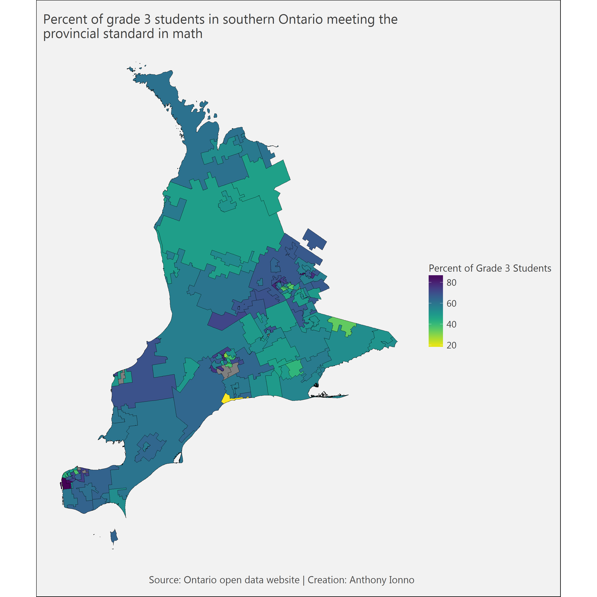 

```

#### Proportion of Grade 6 Students Meeting the Provincial Standard in Mathematics by FSA

```{r,cache=FALSE,out.height="1000px",out.width="1000px",message=FALSE,warning=FALSE,dpi=300}
##################
# Grade 6 maps
##################

# # Ontario
# gr6_map0<-ggplot()+
#   geom_polygon(data=Ontario_shp2[complete.cases(Ontario_shp2),],
#                aes(x=long, y=lat,group=group,fill=`Percent of Grade 6 Students`),
#                color="black",size=0.0)
# gr6_map0<-gr6_map0+ scale_fill_viridis(option = "D",direction=-1)
# gr6_map0<-gr6_map0 + theme_map() + coord_fixed()
# gr6_map0<-gr6_map0 + labs(title="Percent of grade 6 students in Ontario meeting the\nprovincial standard in math",
#                           caption="Source: Ontario open data website | Creation: Anthony Ionno") 
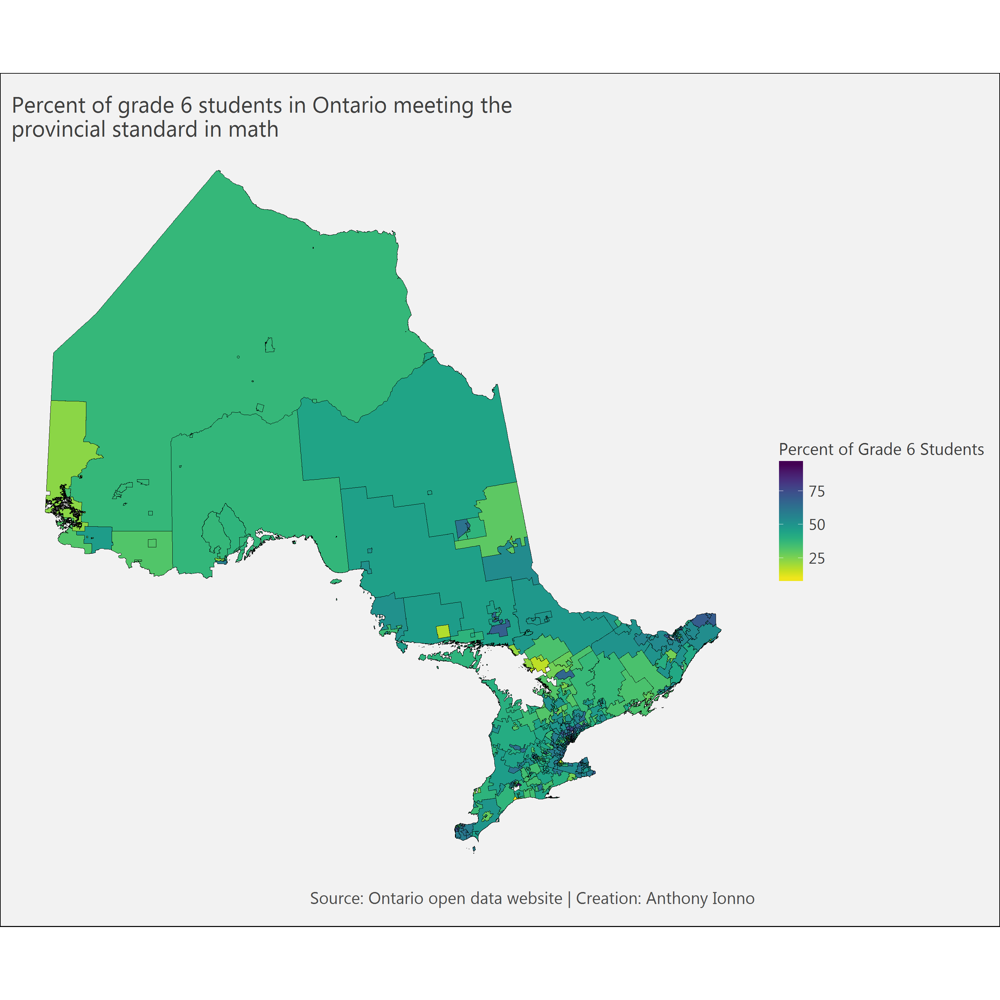 
# 
# # Northern Ontario
# gr6_map1<-ggplot()+
#   geom_polygon(data=filter(Ontario_shp2,Region=="Northern Ontario"),
#                aes(x=long, y=lat,group=group,fill=`Percent of Grade 6 Students`),
#                color="black",size=0.0)
# gr6_map1<-gr6_map1+ scale_fill_viridis(option = "D",direction=-1)
# gr6_map1<-gr6_map1 + theme_map() + coord_fixed()
# gr6_map1 + labs(title="Percent of grade 6 students in northern Ontario meeting the\nprovincial standard in math",
#                 caption="Source: Ontario open data website | Creation: Anthony Ionno") 
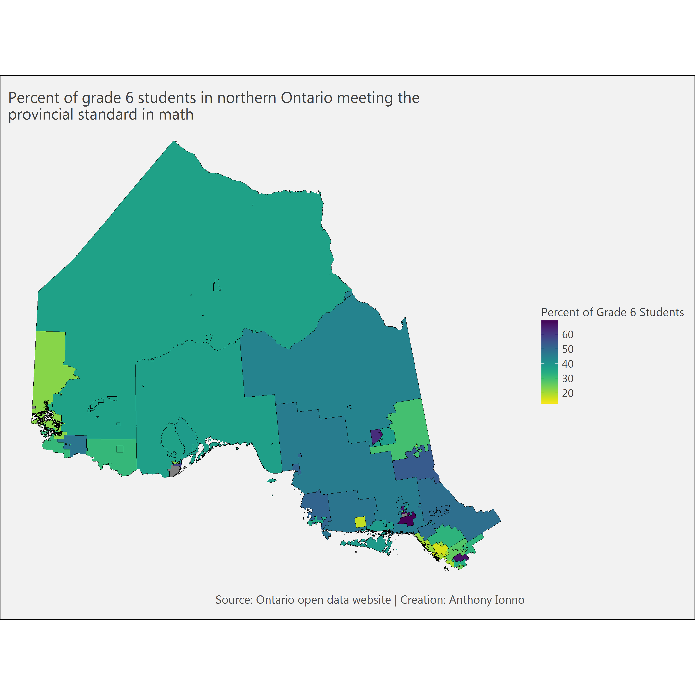 
# # Toronto
# gr6_map2<-ggplot()+
#   geom_polygon(data=filter(Ontario_shp2,Region=="Toronto"),
#                aes(x=long, y=lat,group=group,fill=`Percent of Grade 6 Students`),
#                color="black",size=0.0)
# gr6_map2<-gr6_map2+ scale_fill_viridis(option = "D",direction=-1)
# gr6_map2<-gr6_map2 + theme_map() + coord_fixed()
# gr6_map2 + labs(title="Percent of grade 6 students in Toronto meeting the\nprovincial standard in math",
#                 caption="Source: Ontario open data website | Creation: Anthony Ionno")
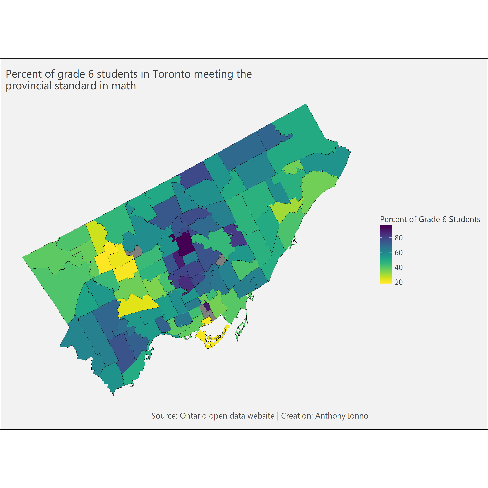 
# 
# # Central Ontario
# gr6_map6<-ggplot()+
#   geom_polygon(data=filter(Ontario_shp2,Region=="Central Ontario"),
#                aes(x=long, y=lat,group=group,fill=`Percent of Grade 6 Students`),
#                color="black",size=0.0)
# gr6_map6<-gr6_map6+ scale_fill_viridis(option = "D",direction=-1)
# gr6_map6<-gr6_map6 + theme_map() + coord_fixed()
# gr6_map6 + labs(title="Percent of grade 6 students in central Ontario meeting the\nprovincial standard in math",
#                 caption="Source: Ontario open data website | Creation: Anthony Ionno") 
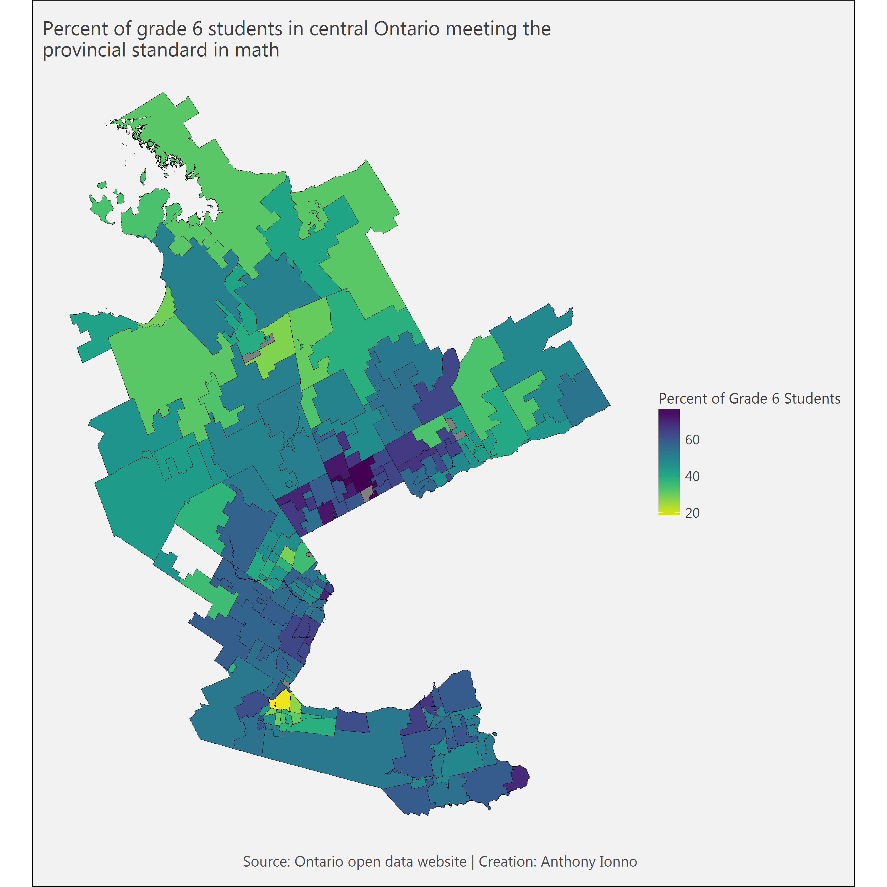 
# 
# # Eastern Ontario
# gr6_map4<-ggplot()+
#   geom_polygon(data=filter(Ontario_shp2,Region=="Eastern Ontario"),
#                aes(x=long, y=lat,group=group,fill=`Percent of Grade 6 Students`),
#                color="black",size=0.0)
# gr6_map4<-gr6_map4+ scale_fill_viridis(option = "D",direction=-1)
# gr6_map4<-gr6_map4 + theme_map() + coord_fixed()
# gr6_map4 + labs(title="Percent of grade 6 students in eastern Ontario meeting the\nprovincial standard in math",
#                 caption="Source: Ontario open data website | Creation: Anthony Ionno") 
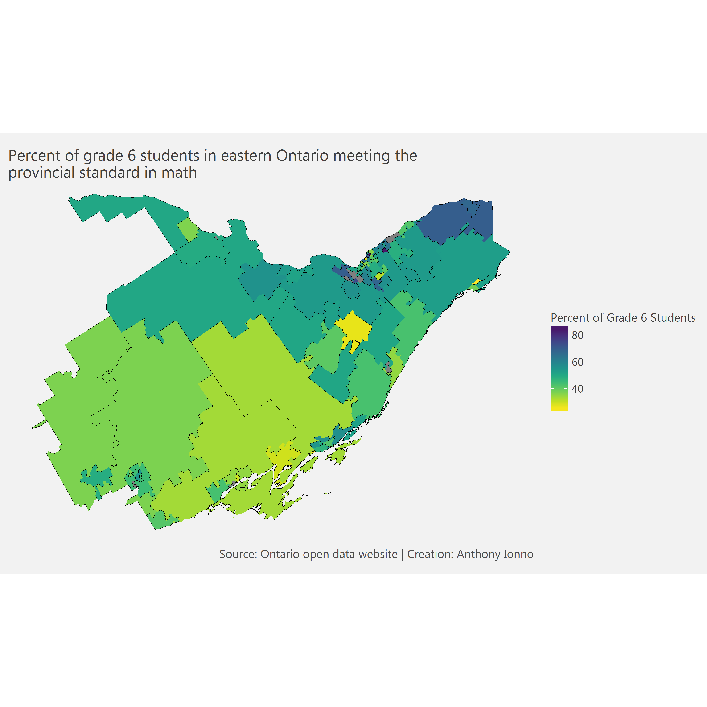 

# # Southern Ontario
# 
# gr6_map4<-ggplot()+
#   geom_polygon(data=filter(Ontario_shp2,Region=="Southern Ontario"),
#                aes(x=long, y=lat,group=group,fill=`Percent of Grade 6 Students`),
#                color="black",size=0)
# gr6_map4<-gr6_map4+ scale_fill_viridis(option = "D",direction = -1)
# gr6_map4<-gr6_map4 + theme_map() + coord_fixed()
# gr6_map4 + labs(title="Percent of grade 6 students in southern Ontario meeting the\nprovincial standard in math",
#                 caption="Source: Ontario open data website | Creation: Anthony Ionno") 
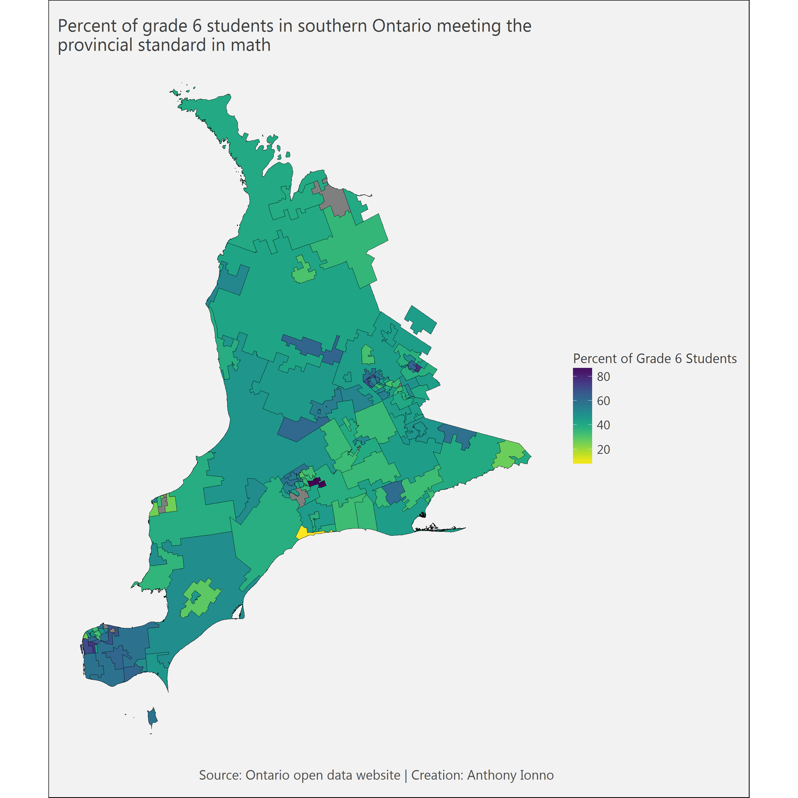 


```
